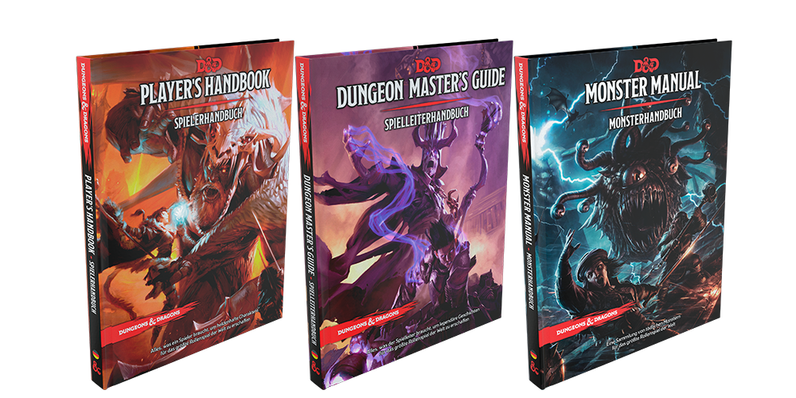
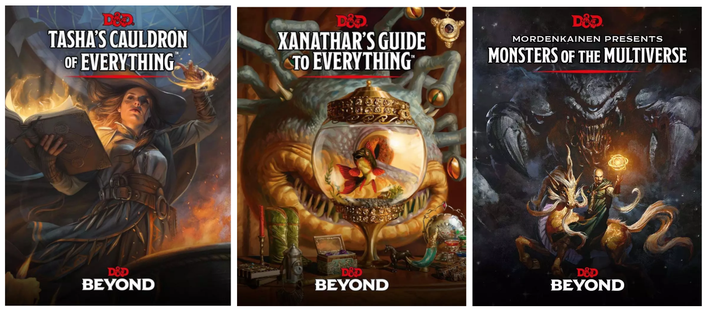
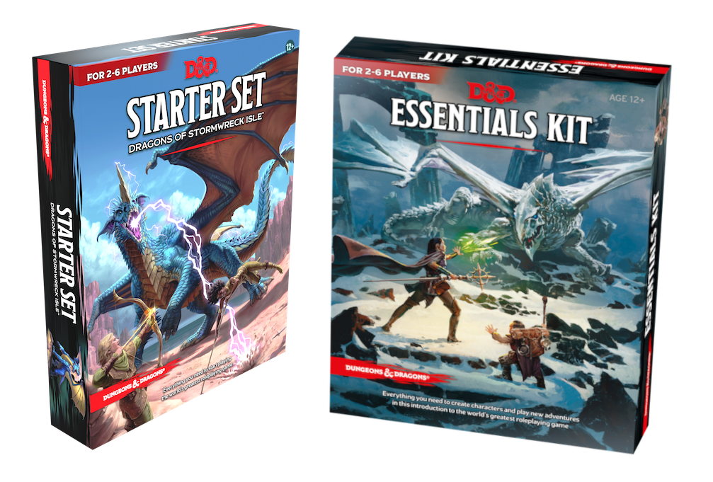

# ดันเจี้ยนและมังกร (Dungeons & Dragons)

เกมดันเจี้ยนและมังกร (Dungeons & Dragons) เป็นเกมสวมบทบาท ให้คุณกับเพื่อนได้เป็นนักผจญภัยหลากหลายเผ่าพันธุ์และอาชีพ บุกตะลุยสุสานโบราณ ปกป้องเมือง ช่วยเหลือชาวบ้านที่เดือดร้อน ใช้ทักษะความสามารถที่คุณมีฝ่าฟันอุปสรรคต่าง ๆ และใช้ชีวิตในโลกแห่ง D&D

ทุกคนสามารถส่ง PR (pull request) แก้ไขและช่วยแปลได้ครับ ไม่มีลิขสิทธิ์ใด ๆ ไม่ต้องให้เครดิต แค่มีประโยชน์กับคุณก็ใช้ได้แล้ว

ขอให้สนุกกับการเล่นเกมครับ

## รู้จักกับ D&D

D&D แต่ละเวอร์ชันจะออกกฏเป็นชุดหนังสือ เรียกว่า ซอร์ส (sources) แบ่งเป็น หนังสือกฏหลัก ([Core rule books](https://marketplace.dndbeyond.com/core-rules)) มี 3 เล่ม เล่มหลักเรียกว่า คู่มือผู้เล่น (Player handbook) มีข้อมูลเผ่าพันธู์ อาชีพหรือคลาส กฏการเล่นรวมถึงข้อมูลอื่น ๆ เป็นเล่มสำคัญที่หากจะเล่นจริงจัง อย่างน้อยควรมีเล่มนี้

เล่ม 2 เรียกว่า คู่มือของดันเจี้ยนมาสเตอร์ (Dungeon Master Guide) มีเนื้อหาเรื่องการดำเนินเกม การสร้างโลกและเรื่องราวการผจญภัยของเราเอง 

เล่ม 3 คือ รายการมอนสเตอร์ (Monster Manual) รวมรายการมอนสเตอร์ รายละเอียดและสแต็ตบล็อค (Stat block) ของมอนสเตอร์แต่ละตัว เอาไว้ให้ DM ไปใช้รันเกมได้

อีกชุดเป็นข้อมูลเสริม ([Expanded Rules](https://marketplace.dndbeyond.com/expanded-rules)) มีหลายเล่มโดยจะออกมาเพิ่มเรื่อย ๆ เล่มที่แนะนำมี 3 เล่มคือ 
- หม้อใหญ่แห่งสรรพสิ่งของทาร์ชาร์ (Tasha's Cauldron of Everything)
- คู่มือสรรพสิ่งของซาร์นาธาร์ (Xanathar's Guide to Everything) และ 
- มอร์เดนไคเน็น เสนอ: มอนสเตอร์แห่งมัลติเวอร์ส (Mordenkainen Presents: Monsters of the Multiverse)

มีหนังสือส่วนเสริม ฉากท้องเรื่อง (settings) และเนื้อเรื่องการผจญภัย (adventures) มากมาย ทั้งจาก Wizard of the coast เจ้าของลิขสิทธิ์เกม จากเว็บ [dndbeyond.com](https://dndbeyond.com) และจากผู้เขียนอื่น ๆ คุณสามารถหาเพิ่มเติมได้จาก [dmsguild.com](https://dmsguild.com) และ [drivethrurpg.com](https://drivethrurpg.com) เป็นต้น

แต่หากคุณไม่เคยเล่นเกมนี้มาก่อนเลย อยากลองเล่นดูก่อน ก็มีชุดเริ่มต้น เรียกว่า Starter Set และ Essential Kit ซึ่งจะมี กฏพื้นฐาน (Basic Rule), เนื้อเรื่องในการผจญภัย (Adventure) ลูกเต๋า ใบบันทึกข้อมูลตัวละครหรือคาแร็กเตอร์ชีต (Character sheet) และอุปกรณ์อื่น ๆ พร้อมให้คุณเล่นกับเพื่อนได้ทันที

## กฏและข้อมูลอื่น ๆ (Sources)

[กฏพื้นฐาน (Basic Rules)](/basic-rules/index.md) แปลแล้ว ~40%  

ถ้าแค่อยากลองศึกษา ยังไม่อยากซื้ออะไรตอนนี้ สามารถอ่านกฏพื้นฐาน (Basic Rules) ได้ เนื้อหาส่วนใหญ่เหมือนกับคู่มือผู้เล่น (Player Handbook) เพียงแต่ตัดเนื้อหาบางส่วนออกไป คุณสามารถอ่านเวอร์ชันอย่างเป็นทางการ (official) ได้ฟรีที่เว็บ https://www.dndbeyond.com/sources/basic-rules หรืออย่างไม่เป็นทางการก็ตามลิงค์ข้างบนเลยครับ :)

## เนื้อเรื่องการผจญภัย (Adventures)
ในการเล่นเกม ดันเจี้ยนมาสเตอร์ (Dungeon Master) หรือ DM จะเป็นคนเล่าเรื่องและให้ผู้เล่น (Player) ตัดสินใจไปตามสถานการณ์ เรื่องที่ DM เล่านี้เราเรียกว่า การผจญภัย (Adventure) เนื้อเรื่องสั้น ๆ เราจะเรียกว่า วันช็อต (one-shot) อาจจะเป็นภาระกิจเดียว ใช้เวลา 3-4 ชม. ก็เล่นจบ ส่วนเนื้อเรื่องยาวจะเรียกว่าแคมเปญ (Campaign) มีหลายภาระกิจและต้องเล่นหลายเซสชัน (เซสชัน (Session) คือชื่อเรียกช่วงเวลาที่เล่นเกมแต่ละครั้ง) ตัวละครจะมีการเลื่อนระดับ (level) โตขึ้นแข็งแกร่งขึ้น แคมเปญอาจจะมีตั้งแต่ 4-5 เซสชันไปจนถึงหลายสิบเซสชัน บางกลุ่มเล่นกันยาวนานเป็นสิบปี สนุกจนน่าอิจฉา

### แคมเปญ (Campaign)
รายการด้านล่างนี้เป็นแคมเปญที่คาดว่าจะแปลให้เสร็จ

[เหมืองที่สาบสูญแห่งแฟนเดลเวอร์ (Lost Mine of Phandelver)](/lost-mine-of-phandelver/lost-mine-of-phandelver.md) แปลแล้ว 0%  
เป็น starter set กล่องแรกของ D&D เวอร์ชัน 5 (5e) เป็นเรื่องราวของเหมืองเวทย์มนต์ที่สาบสูญแห่งภาคีแฟนเดลเวอร์ ที่จู่ ๆ ก็มีข่าวว่าถูกค้นพบที่บริเวณเมืองแฟนเดลิน

[มังกรแห่งยอดเขาไอส์สไปร์ (Dragon of Icespire Peak)](./dragon-of-icespire-peak/dragon-of-icespire-peak.md) แปลแล้ว 0%  
เป็นเนื้อเรื่องการผจญภัยของ Essentials Kit มังกรขายไครโอเวนยึดครองยอดเขาไอส์สไปร์ เทียกเขาสูงหนาวเย็นทางตะวันออกของเมืองแฟนเดลิน การมาของมันทำให้เกิดความโกลาหลไปทั่ว คุณต้องขับไล่ (หรือกำจัด) เจ้ามังกรร้ายให้ออกไปจากพื้นที่

[มังกรแห่งหมู่เกาะสตอร์มเรว์ก (Dragon of Stormwreck Isle)](./dragons-of-stormwreck-isle/dragons-of-stormwreck-isle.md) แปลแล้ว 0%  
เป็นเนื้อเรื่องผจญภัยของ Starter Set ชุดใหม่ เกาะสตอร์มเรว์ก อยู่ทางตะวันตกของคาบสมุทรซอร์ด ตำนานกล่าวว่าเป็นสมรภูมิของมังกรสองเผ่า ห้ำหั่นกันจนทำให้บริเวณเกาะมีเวทย์มนต์ตกค้างจากมังกรที่จบชีวิตที่นี่ การผจญภัยของเหล่านักผจญภัยที่มีจุดมุ่งหมายต่างกัน แต่ก็มีจุดหมายเดียวกันคือที่เกาะแห่งนี้จึงเริ่มขึ้น

### เรื่องสั้น (One-shot)

[หลุมมรณะแห่งโมลอค (Dead Pit of Moloch)](/one-shot/dead-pit-of-moloch.pdf) แปลแล้ว 100%  
พวกคุณนักผจญภัยรับงานตามหาคนหาย แต่จู่ ๆ คุณก็ตื่นขึ้นมาพบว่าตัวเองอยู่ในหลุมลึก

[ภยันตรายในไพน์บรู๊ค (Peril in Pinebrook)](./one-shot/peril-in-pinebrook.md) แปลแล้ว 0%  
วันปกติวันหนึ่งในหมู่บ้านไพน์บรูก คุณและกลุ่มยามอาสาออกลาดตระเวณระวังภัยเป็นปกติ จนกระทั่งพวกคุณได้พบกับสิ่งไม่ปกติที่ชายป่า

---

มอนสเตอร์บางส่วนนำมาจาก https://github.com/vitusventure/5thSRD

---
“Content in this repository is unofficial Fan Content permitted under the Fan Content Policy. Not approved/endorsed by Wizards. Portions of the materials used are property of Wizards of the Coast. ©Wizards of the Coast LLC.”

เนื้อหาในรีโพสิทอรีนี้เป็นเนื้อหาอย่างไม่เป็นทางการจากแฟนคลับ (Fan Content) ได้รับอนุญาตภายใต้นโยบายเนื้อหาจากแฟนคลับ ไม่ได้รับการรับรอง / สนับสนุนจากบริษัทวิซาร์ดฯ เนื้อหาบางส่วนที่ใช้เป็นทรัพย์สินของบริษัท วิซาร์ด ออฟ เดอะ โคสต์. ©Wizards of the Coast LLC. 

https://company.wizards.com/en/legal/fancontentpolicy