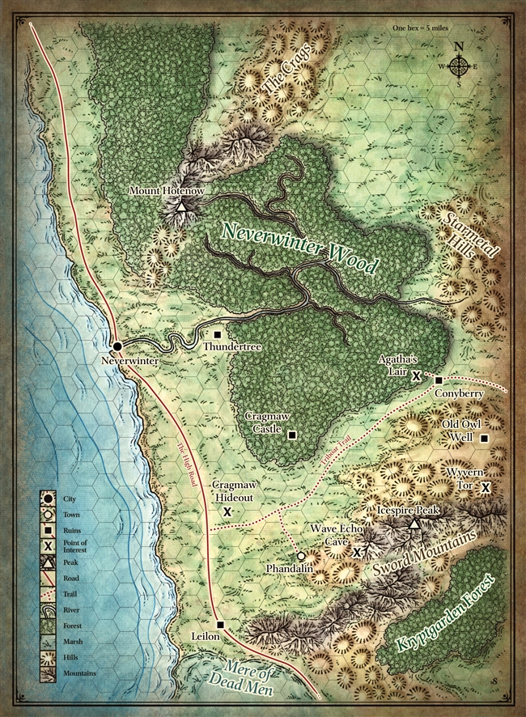
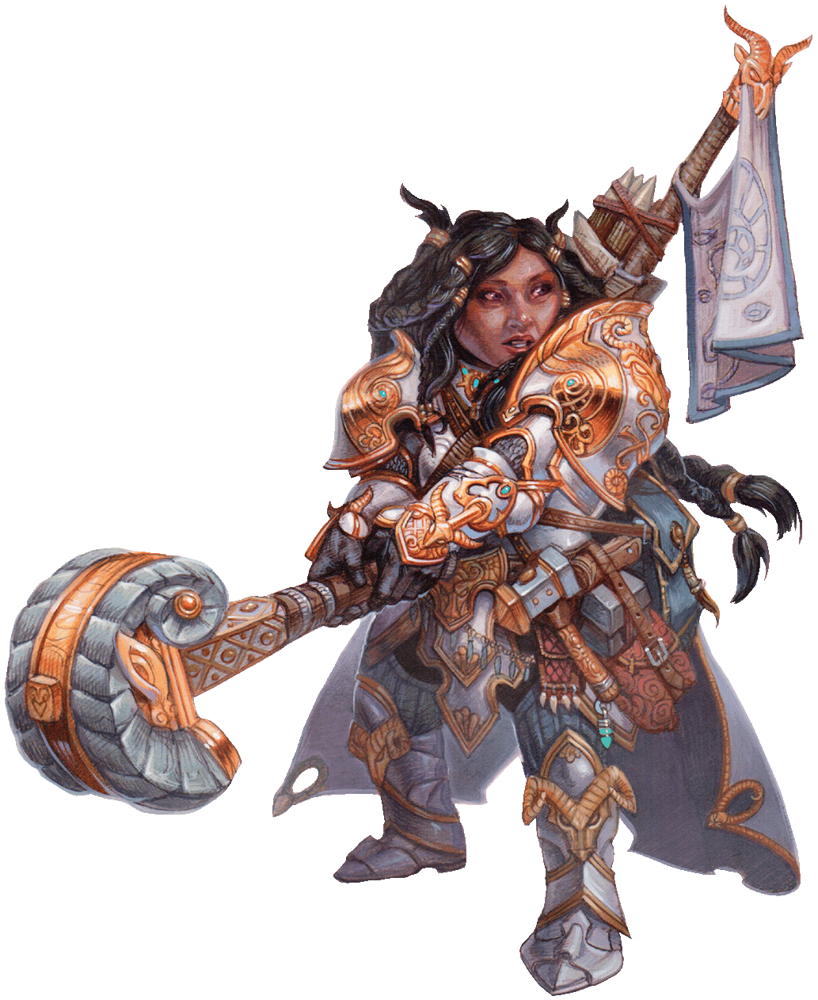
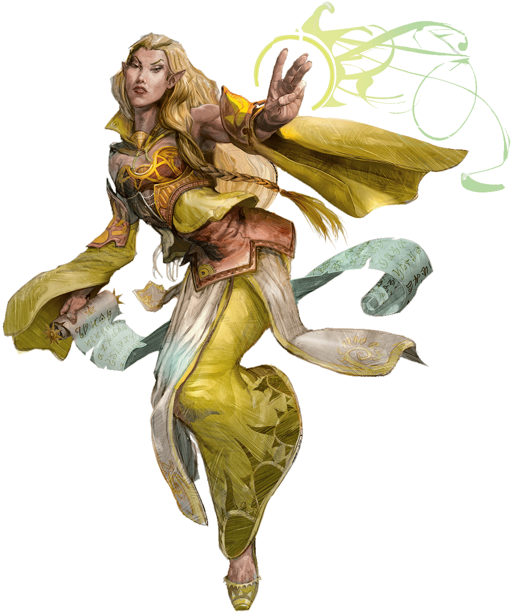
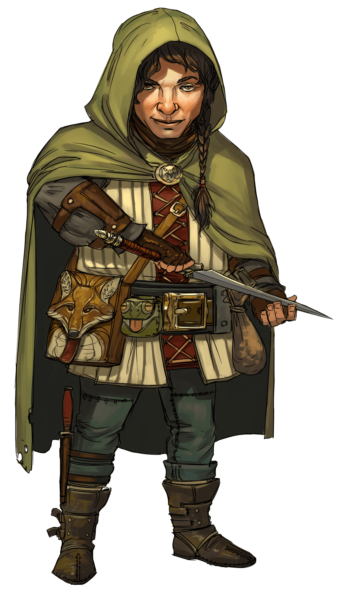
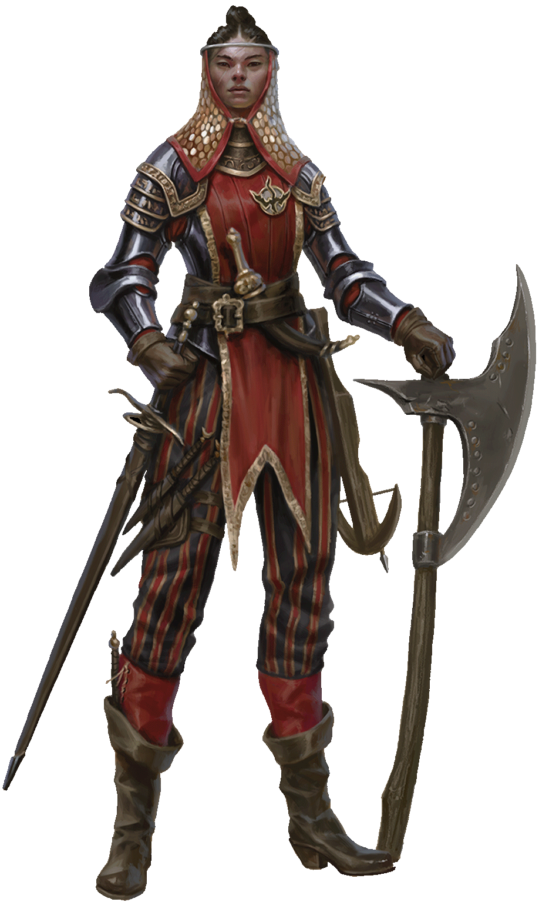
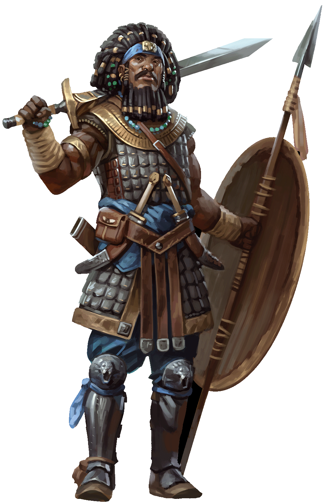
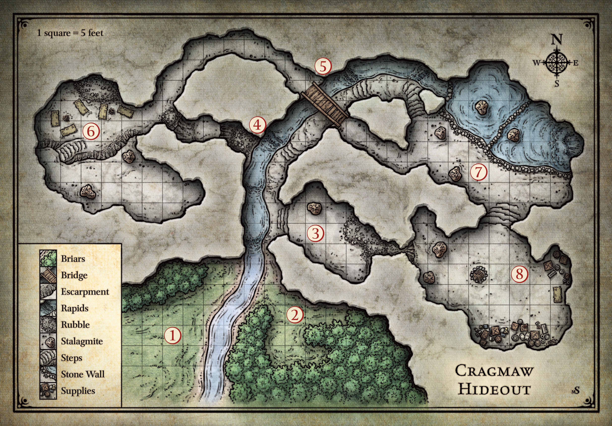

# เหมืองที่สาปสูญแห่งแฟนเดลเวอร์ ([1491 DR](https://forgottenrealms.fandom.com/wiki/1491_DR))

## Contents
## Introduction
- Running the Adventure
- Background
- Overview
- Adventure Hook
- The Forgotten Realms
- Premade Characters

## Part 1: Goblin Arrows
- Goblin Ambush
- Cragmaw Hideout

## Part 2: Phandalin
- Encounters in Phandalin
- Important NPCs
- Town Description
- Redbrand Ruffians
- Redbrand Hideout

## Part 3: The Spider's Web
- Triboar Trail
- Conyberry and Agatha's Lair
- Old Owl Well
- Ruins of Thundertree
- Wyvern Tor
- Cragmaw Castle

## Part 4: Wave Echo Cave
- Character Level
- Experience Point Awards
- Wandering Monsters
- General Features
- Keyed Encounters
- Conclusion

## Appendix A: Magic Items
- Using a Magic Item
- Item Descriptions

## Appendix B: Monsters
- Statistics
- Monster Descriptions

## Credits

# Introduction
This content is written for the Dungeon Master. It contains a complete Dungeons & Dragons adventure, as well as descriptions for every creature and magic item that appears in the adventure. It also introduces the world of the Forgotten Realms, one of the game’s most enduring settings, and it teaches you how to run a D&D game.

The [Basic Rules](/basic-rules/) contain the rules you need to adjudicate situations that arise during the adventure.

## Running the Adventure
Lost Mine of Phandelver is an adventure for four to five characters of 1st level. During the course of the adventure, the characters will advance to 5th level. The adventure is set a short distance from the city of Neverwinter in the Sword Coast region of the Forgotten Realms setting. The Sword Coast is part of the North — a vast realm of free settlements surrounded by wilderness and adventure. You don’t need to be a Forgotten Realms expert to run the adventure; everything you need to know about the setting is contained in this content.

If this is your first time running a D&D adventure, read “[The Dungeon Master]()” section; it will help you better understand your role and responsibilities.

The “[Background]()” section tells you everything you need to know to set up the adventure. The “[Overview]()” section describes how the adventure is expected to run and gives you a broad sense of what the player characters should be doing at any given time.

## The Dungeon Master
The Dungeon Master (DM) has a special role in the Dungeons & Dragons game.

The DM is a **referee**. When it’s not clear what ought to happen next, the DM decides how to apply the rules and keep the story going.

The DM is a **narrator**. The DM sets the pace of the story and presents the various challenges and encounters the players must overcome. The DM is the players’ interface to the D&D world, as well as the one who reads (and sometimes also writes) the adventure and describes what happens in response to the characters’ actions.

The DM **plays monsters**. The DM plays the monsters and villains the adventurers battle against, choosing their actions and rolling dice for their attacks. The DM also plays the part of all the other characters the players meet in the course of their adventures, like the prisoner in the goblin lair or the innkeeper in town.

Who should be the DM for your gaming group? Whoever wants to be! The person who has the most drive to pull a group together and start up a game often ends up being the DM by default, but that doesn’t have to be the case.

Although the DM controls the monsters and villains in the adventure, the relationship between the players and the DM isn’t adversarial. The DM’s job is to challenge the characters with interesting encounters and tests, keep the game moving, and apply the rules fairly.

The most important thing to remember about being a good DM is that the rules are a tool to help you have a good time. The rules aren’t in charge. You’re the DM — you’re in charge of the game. Guide the play experience and the use of the rules so that everybody has fun.

Many players of Dungeons & Dragons find that being the DM is the best part of the game. With the information in this adventure, you’ll be prepared to take on that role for your group.

>RULES TO GAME BY
>
>As the Dungeon Master, you are the final authority when it comes to rules questions or disputes during the game. Here are some guidelines to help you arbitrate issues as they come up.
>
>**When in doubt, make it up!** It’s better to keep the game moving than to get bogged down in the rules.
>
>**It’s not a competition.** The DM isn’t competing against the player characters. You’re there to >run the monsters, referee the rules, and keep the story moving.
>
>**It’s a shared story.** It’s the group’s story, so let the players contribute to the outcome through the actions of their characters. Dungeons & Dragons is about imagination and coming together to tell a story as a group. Let the players participate in the storytelling.
>
>**Be consistent.** If you decide that a rule works a certain way in one session, make sure it works that way the next time it comes into play.
>
>**Make sure everyone is involved.** Ensure every character has a chance to shine. If some players >are reluctant to speak up, remember to ask them what their characters are doing.
>
>**Be fair.** Use your powers as Dungeon Master only for good. Treat the rules and the players in a fair and impartial manner.
>
>**Pay attention.** Make sure you look around the table occasionally to see if the game is going well. If everyone seems to be having fun, relax and keep going. If the fun is waning, it might be time for a break, or you can try to liven things up.

## Improvising Ability Checks
The adventure often tells you what ability checks characters might try in a certain situation and the Difficulty Class (DC) of those checks. Sometimes adventurers try things that the adventure can’t possibly anticipate. It’s up to you to decide whether their attempts are successful. If it seems like anyone should have an easy time doing it, don’t ask for an ability check; just tell the player what happens. Likewise, if there’s no way anyone could accomplish the task, just tell the player it doesn’t work.

Otherwise, answer these three simple questions:

- What kind of ability check?
- How hard is it?
- What’s the result?

Use the descriptions of the ability scores and their associated skills in the Basic Rules to help you decide what kind of ability check to use. Then determine how hard the task is so that you can set the DC for the check. The higher the DC, the more difficult the task. The easiest way to set a DC is to decide whether the task’s difficulty is easy, moderate, or hard, and use these three DCs:

- Easy (DC 10). An easy task requires a minimal level of competence or a modicum of luck to accomplish.
- Moderate (DC 15). A moderate task requires a slightly higher level of competence to accomplish. A character with a combination of natural aptitude and specialized training can accomplish a moderate task more often than not.
- Hard (DC 20). Hard tasks include any effort that is beyond the capabilities of most people without aid or exceptional ability. Even with aptitude and training, a character needs some amount of luck — or a lot of specialized training — to pull off a hard task.

The outcome of a successful check is usually easy to determine: the character succeeds at whatever he or she set out to accomplish, within reason. It’s usually equally easy to figure out what happens when a character fails a check: the character simply doesn’t succeed.

## Glossary
The adventure uses terms that might be unfamiliar to you. A few of these terms are described here. For descriptions of rules-specific terms, see the [Basic Rules]().

**Characters**. This term refers to the adventurers run by the players. They are the protagonists in any D&D adventure. A group of characters or adventurers is called a party.

**Nonplayer Characters (NPCs)**. This term refers to characters run by the DM. How an NPC behaves is dictated by the adventure and by the DM.

**Boxed Text**. At various places, the adventure presents descriptive text that’s meant to be read or paraphrased aloud to players. This read-aloud text is offset in boxes. Boxed text is most commonly used to describe rooms or present bits of scripted dialogue.

**Stat Block**. Any monster or NPC that is likely to be involved in combat requires game statistics so that the DM can run it effectively. These statistics are presented in a format called a **statistics block**, or **stat block**. You’ll find the stat blocks needed for this adventure in [appendix B]().

**Tenday**. In the Forgotten Realms, a week is ten days long and called a tenday. Each month consists of three tendays — thirty days total.

## Magic Items and Monsters
Whenever the text refers to a magic item, its name is presented in italic type. For a description of the item and its magical properties, see [appendix A]().

Similarly, whenever the adventure text presents a creature’s name in bold type, that’s a visual cue directing you to the creature’s game statistics in [appendix B]().

## Abbreviations
The following abbreviations are used in this adventure.

DC = Difficulty Class

XP = experience points

pp = platinum piece(s)

ep = electrum piece(s)

gp = gold piece(s)

sp = silver piece(s)

cp = copper piece(s)

## Background

More than five hundred years ago, clans of dwarves and gnomes made an agreement known as the Phandelver’s Pact, by which they would share a rich mine in a wondrous cavern known as Wave Echo Cave. In addition to its mineral wealth, the mine contained great magical power. Human spellcasters allied themselves with the dwarves and gnomes to channel and bind that energy into a great forge (called the Forge of Spells), where magic items could be crafted. Times were good, and the nearby human town of Phandalin (pronounced fan-duh-lin) prospered as well. But then disaster struck when orcs swept through the North and laid waste to all in their path.

A powerful force of orcs reinforced by evil mercenary wizards attacked Wave Echo Cave to seize its riches and magic treasures. Human wizards fought alongside their dwarf and gnome allies to defend the Forge of Spells, and the ensuing spell battle destroyed much of the cavern. Few survived the cave-ins and tremors, and the location of Wave Echo Cave was lost.

For centuries, rumors of buried riches have attracted treasure seekers and opportunists to the area around Phandalin, but no one has ever succeeded in locating the lost mine. In recent years, people have resettled the area. Phandalin is now a rough-and-tumble frontier town. More important, the Rockseeker brothers — a trio of dwarves — have discovered the entrance to Wave Echo Cave, and they intend to reopen the mines.

Unfortunately for the Rockseekers, they are not the only ones interested in Wave Echo Cave. A mysterious villain known as the Black Spider controls a network of bandit gangs and goblin tribes in the area, and his agents have followed the Rockseekers to their prize. Now the Black Spider wants Wave Echo Cave for himself, and he is taking steps to make sure no one else knows where it is.

## Overview
*Lost Mine of Phandelver* is divided into four parts. In [part 1, “Goblin Arrows,”]() the adventurers are on the road to the town of Phandalin when they stumble into a goblin ambush. They discover that the goblins (who belong to the Cragmaw tribe) have captured their dwarf friend Gundren Rockseeker and his escort, a human warrior named [Sildar Hallwinter](). The characters must deal with the ambushers and then follow their trail back to the goblins’ hideout. They rescue Sildar and learn from him that Gundren and his brothers discovered a famous lost mine. Sildar knows only that Gundren and his map have been taken to somewhere called “Cragmaw Castle.”

In [part 2, “Phandalin,”]() the characters arrive in Phandalin to find it terrorized by the Redbrands, a gang of miscreants led by a mysterious figure called Glasstaff. A number of interesting NPCs can also be found in Phandalin, laying the hooks for short adventures in part 3. The Redbrands try to run the characters out of town, so the characters return the favor and storm the Redbrand lair. In a hidden stronghold beneath an old manor, they find that Iarno “Glasstaff” Albrek, the leader of the Redbrands, is taking his orders from someone called the Black Spider — and that the Black Spider wants the adventurers out of the picture.

[Part 3, “The Spider’s Web,”]() provides the characters with several short adventures in the region around Phandalin as they search for more information about the Black Spider and the dwarves’ lost mine. The clues the characters picked up in Phandalin can lead them to spy on a mysterious wizard at the ruins of Old Owl Well, seek the advice of a dangerous banshee, oust a band of orcs lurking at Wyvern Tor, and investigate the ruins of the town of Thundertree.

Several of these leads point to Cragmaw Castle, which is the stronghold of [King Grol](), leader of the Cragmaw goblins. Here the characters discover that the Black Spider is a drow adventurer named [Nezznar](), and that the Cragmaw goblins work for him (drow are elves who hail from a realm deep underground). More importantly, they recover Gundren Rockseeker’s map to the lost mine, or learn the mine’s location from one of the other leads they unearth during part 3.

Following the map or the directions to the lost mine brings the characters to [part 4, “Wave Echo Cave.”]() That lost underground complex is now overrun by undead and strange monsters. Nezznar the Black Spider is there with his loyal followers, exploring the mines and searching for the legendary Forge of Spells. The adventurers have the opportunity to avenge Gundren Rockseeker, to ensure the prosperity and security of Phandalin by clearing the rich mine of its monsters, and to put an end to the troublemaking of the Black Spider — if they can survive the dangers of the Lost Mine of Phandelver.

## Adventure Hook
You can let players invent their own reasons for visiting Phandalin, or you can use the following adventure hook. The backgrounds and secondary goals on the character sheets also provide characters with motivations for visiting Phandalin.

**Meet Me in Phandalin.** The characters are in the city of Neverwinter when their dwarf patron and friend, Gundren Rockseeker, hires them to escort a wagon to Phandalin. Gundren has gone ahead with a warrior, Sildar Hallwinter, to attend to business in the town while the characters follow with the supplies. The characters will be paid 10 gp each by the owner of Barthen’s Provisions in Phandalin when they deliver the wagon safely to that trading post.

## The Forgotten Realms
Just like a fantasy novel or movie, an adventure is set in a larger world. In fact, the world can be anything that the DM and players can imagine. It could be a swords-and-sorcery setting at the dawn of civilization, where barbarians battle evil sorcerers, or a post-apocalyptic fantasy where elves and dwarves wield magic amid the wreckage of a technological civilization. Most D&D settings are somewhere between those two extremes: worlds of medieval high fantasy with knights and castles, as well as elven cities, dwarven mines, and fearsome monsters.

The world of the Forgotten Realms is one such setting, and that’s where the story in this adventure takes place. In the Realms, knights dare the crypts of the fallen dwarf kings of Delzoun, seeking glory and treasure. Rogues prowl the dark alleyways of teeming cities such as Neverwinter and Baldur’s Gate. Clerics in the service of gods wield mace and spell, questing against the terrifying powers that threaten the land. Wizards plunder the ruins of the fallen Netherese empire, delving into secrets too dark for the light of day. Dragons, giants, demons, and unimaginable abominations lurk in dungeons, caverns, ruined cities, and the vast wild places of the world.

On the roads and rivers of the Realms travel minstrels and peddlers, merchants and guards, soldiers, sailors, and steel-hearted adventurers carrying tales of strange, glorious, faraway places. Good maps and clear trails can take even an inexperienced youth with dreams of glory far across the world. Thousands of restless would-be heroes from backcountry farmsteads and sleepy villages arrive in Neverwinter and the other great cities every year in search of wealth and renown.

Known roads may be well traveled, but they aren’t necessarily safe. Fell magic, deadly monsters, and cruel local rulers are all perils that you face when you travel in the Forgotten Realms. Even farms and freeholds within a day’s walk of a city can fall prey to monsters, and no place is safe from the sudden wrath of a dragon.

The regional map shows just a tiny part of this vast world, in a region called the Sword Coast. This is a region of adventure, where daring souls delve into the wreckage of ancient strongholds and explore ruins of long-lost cultures. Amid a wilderness of jagged, snow-capped peaks, alpine forests, lawlessness, and monsters, the coast holds the greatest bastions of civilization, including the coastal city of Neverwinter.

>ROLEPLAYING AND INSPIRATION
>
>One of the things that you can do as the DM is reward players for roleplaying their characters well.
>
>Each of the characters included in this set has two [personality traits]() (one positive and one negative), an ideal, a bond, and a flaw. These elements can make the character easier and more fun to roleplay. Personality traits provide a glimpse into the character’s likes, dislikes, accomplishments, fears, attitude, or mannerisms. An [ideal]() is something that the character believes in or strives for above all else. A character’s [bond]() represents a connection to a person, place, or event in the world — someone the character cares about, a place that holds a special connection, or a treasured possession. A [flaw]() is a characteristic that someone else can exploit to bring the character to ruin or cause the character to act against his or her best interests.
>
>When a player roleplays a negative personality trait or gives in to a drawback presented by a bond or a flaw, you can give that player’s character one [inspiration]() as a reward. The player can then spend it when his or her character makes an ability check, an attack roll, or a saving throw. Spending inspiration gives the character [advantage]() on the roll. A clever player might spend the inspiration to counteract [disadvantage]() on a roll.
>
>A character can have only one inspiration at a time.

[View Player Version](./assets/lmop2.jpg)

## Premade Characters
These premade character sheets are available to claim.

### Dwarven Cleric

Trained as a soldier on the island of Mintarn, you traveled to Neverwinter as part of a mercenary company that serves as both army and city watch. You grew disillusioned with your fellow soldiers, who seem to enjoy their authority at the expense of the people they’re supposed to protect. Everything came to a head recently, when you disobeyed an order and followed your conscience. You were suspended from active duty, though you kept your rank and your connection to the mercenaries. Since then, you have devoted yourself to your deity.

**Personal Goal: Teach the Redbrands a Lesson.** You’ve heard that Daran Edermath in the town of Phandalin is looking for people of courage and principle to teach some bullies a lesson. These thugs, the Redbrands, have been throwing their weight around in Phandalin, much as your compatriots did in Neverwinter. Putting a stop to their villainy is a worthy goal.

**Alignment: Neutral Good.** Your conscience, not law and authority, will guide you to do the right thing. Power is meant to be used for the benefit of all, not to oppress the weak.

[View character sheet](https://www.dndbeyond.com/characters/95592044)

[Downloadble PDF](./assets/dwarf-cleric.pdf)

### Elven Wizard

You have spent your life dedicated to Oghma, all-seeing god of knowledge, and spent years learning the lore of the multiverse.

**Personal Goal: Reconsecrate the Defiled Altar.** Through visions delivered in your trances, your god has called you to a new mission. A goblin tribe has made its lair in an ancient ruin now called Cragmaw Castle, where they have defiled a shrine once sacred to Oghma. Now dedicated to the vile goblin god Maglubiyet, the altar is an offense to Oghma that must not stand.

You’re sure Oghma has greater things in store for you if you can complete this quest. In the meantime, your visions suggest that Sister Garaele—a priest of Tymora, the goddess of luck—can aid you in the town of Phandalin.

**Alignment: Chaotic Good.** The pursuit and acquisition of knowledge is for the benefit of all. Kingdoms and laws are useful so far as they allow knowledge to flourish. Tyrants who seek to suppress and control it are the worst villains. You share your knowledge freely, and use what you have learned to help where you can.

[View character sheet](https://www.dndbeyond.com/characters/95473369)

[Downloadble PDF](./assets/elf-wizard.pdf)

### Halfling Rogue

The town of Phandalin is built on the ruins of an older settlement, vacant for five centuries until some hardy settlers set about rebuilding it some years back. Drawn by stories of gold and platinum in the nearby foothills, you came to Phandalin as well, not to earn a living, but to prey on those who struck it rich. You joined a gang calling itself the Redbrands and made some decent coin as a burglar, enforcer, or fence.

A hooded halfling rogue outfitted in leather armor, stares at you with a bemused expression and with a dagger in their hands
But you must have made an enemy among your fellow Redbrands. Someone set you up. On that person’s word, the head of the Redbrands—a wizard called Glasstaff—tried to have you killed. You escaped, barely alive and thanking Tymora, the goddess of good fortune, for your luck. You fled Phandalin, almost penniless and with only the tools of your trade to your name.

**Personal Goal: Get Your Revenge.** Someone in the Redbrands nearly got you killed, and you sure would like to know who it was. And then you’d like to take your revenge—on that person, on Glasstaff, maybe on all the Redbrands. And you just got a tip that might help you: someone named Halia Thornton also has it out for the Redbrands. She lives in Phandalin, which means showing your face to the Redbrands who still want you dead.

**Alignment: Neutral.** You tend to do whatever seems best at the time. Sure, you’ve done some things you’re not proud of, and you’re not personally committed to making the world a better place. But you have no interest in causing suffering or making things worse than they already are.

[View character sheet](https://www.dndbeyond.com/characters/95531915)

[Downloadble PDF](./assets/halfling-rogue.pdf)

### Human Fighter 1

Your family is no stranger to wealth, power, and privilege. In the glory days of Neverwinter, your parents were the count and countess of Corlinn Hill, a large estate located in the hills northeast of the city. But Mount Hotenow erupted thirty years ago, devastating Neverwinter and erasing Corlinn Hill from the map. Instead of growing up on an estate, you were raised in a small but comfortable town house in Waterdeep. As an adult, you stand to inherit a meaningless title and little else.

**Personal Goal: Civilize Phandalin.** You were meant for more than being a ruler of nothing at all. Rebuilding Corlinn Hill is impractical, thanks to the volcano. But in the last three or four years, hardy settlers have been rebuilding another ruin near the city: the old town of Phandalin, which orcs sacked five centuries ago. Clearly, what Phandalin needs now is a civilizing influence—someone to take the reins and bring law and order. Someone like you.

You’re not the only one with such ideas. A knight named Sildar Hallwinter recently set out for Phandalin in the company of a dwarf named Gundren Rockseeker. They plan to reclaim an ancient mine and restore Phandalin to a civilized center of wealth and prosperity. Since your goals align, Hallwinter should be willing to assist you.

**Alignment: Lawful Neutral.** It’s essential to establish law and order, even if it takes an iron fist to do it. The nobility are bound by honor and tradition to protect their people from both external and internal threats to stability. An organized society leaves no room for evil and chaos to take root.

[View character sheet](https://www.dndbeyond.com/characters/95473157)

[Downloadble PDF](./assets/human-fighter.pdf)

### Human Fighter 2

Your parents lived in the prosperous village of Thundertree, east of the city of Neverwinter and at the edge of the Neverwinter Wood. But when nearby Mount Hotenow erupted thirty years ago, your parents fled, carrying you in your infancy. Your family drifted from village to village around the region, finding work as servants or laborers where they could.

You’ve spent the last few years in Neverwinter as a porter and laborer at the city’s bustling docks. But it’s clear to you and everyone around you that you are destined for much more. You stood up to an abusive ship captain once, so other dockworkers look up to you. Someday, you’ll come into your own. You’ll be a hero.

**Personal Goal: Drive Off the Dragon.** The ruins of Thundertree call to you. Your family and their friends once lived in prosperity there, and now they’re reduced to menial labor. The ruins are haunted by ash zombies, and rumor has it a dragon has made its lair in the Old Tower, but those are problems a hero can solve. Slay the dragon, or drive it off, and you’ll prove—to yourself and everyone else—you’re a real hero, destined for greatness.

**Alignment: Lawful Good.** A hero stands up to evil and never lets bullies have their way. A hero fights for law and order, so that everyone can live in prosperity and happiness. A hero slays monsters, clears ruins, and protects the innocent. You strive to be such a hero.

[View character sheet](https://www.dndbeyond.com/characters/95595276)

[Downloadble PDF](./assets/human-fighter2.pdf)

# Part 1: Goblin Arrows
The adventure begins as the player characters are escorting a wagon full of provisions and supplies from Neverwinter to Phandalin. The journey takes them south along the High Road to the Triboar Trail, which heads east (as shown on the overland map). When they’re a half-day’s march from Phandalin, they run into trouble with goblin raiders from the Cragmaw tribe.

Read the boxed text when you’re ready to start. If you create a different adventure hook, skip to the second paragraph and adjust the details as necessary, ignoring the information about driving the wagon.

>In the city of Neverwinter, a dwarf named Gundren Rockseeker asked you to bring a wagonload of provisions to the rough-and-tumble settlement of Phandalin, a couple of days’ travel southeast of the city. Gundren was clearly excited and more than a little secretive about his reasons for the trip, saying only that he and his brothers had found “something big,” and that he’d pay you ten gold pieces each for escorting his supplies safely to Barthen’s Provisions, a trading post in Phandalin. He then set out ahead of you on horse, along with a warrior escort named Sildar Hallwinter, claiming he needed to arrive early to “take care of business.”
>
>You’ve spent the last few days following the High Road south from Neverwinter, and you’ve just recently veered east along the Triboar Trail. You’ve encountered no trouble so far, but this territory can be dangerous. Bandits and outlaws have been known to lurk along the trail.

Before continuing with the adventure, take a few minutes to do the following:

- Encourage the players to introduce their characters to each other if they haven’t done so already.
- Ask the players to think about how their characters came to know their dwarf patron, Gundren Rockseeker. Let the players concoct their own stories. If a player is hard-pressed to think of anything, suggest something simple. For example, Gundren could be a childhood friend or someone who helped the player’s character get out of a tough scrape. This exercise is a great opportunity for the players to contribute to the adventure’s backstory.
- Ask the players to give you the party’s marching order and how their characters are traveling. Who’s in front, and who’s bringing up the rear? If the characters are escorting Gundren’s wagonload of supplies, then one or two characters need to be driving the wagon. The rest of the characters can be riding on the wagon, walking alongside, or scouting ahead, as they like.

**Driving the Wagon**
Any character can drive a wagon, and no particular skill is necessary. Two oxen pull the wagon. If no one is holding the reins, the oxen stop where they are.

The wagon is packed full of an assortment of mining supplies and food. This includes a dozen sacks of flour, several casks of salted pork, two kegs of strong ale, shovels, picks, and crowbars (about a dozen each), and five lanterns with a small barrel of oil (about fifty flasks in volume). The total value of the cargo is 100 gp.

When you’re ready, continue with the “[Goblin Ambush]()” section.

## Goblin Ambush
Read the following boxed text to start the encounter:

>You’ve been on the Triboar Trail for about half a day. As you come around a bend, you spot two dead horses sprawled about fifty feet ahead of you, blocking the path. Each has several black-feathered arrows sticking out of it. The woods press close to the trail here, with a steep embankment and dense thickets on either side.

If you are using the “[Meet Me in Phandalin]()” adventure hook, then any character who approaches to make a closer investigation can identify the horses as belonging to Gundren Rockseeker and Sildar Hallwinter. They’ve been dead about a day, and it’s clear that arrows killed the horses. When the characters inspect the scene closer, read the following:

>The saddlebags have been looted. Nearby lies an empty leather map case.

Four [goblins](./monsters/goblin.md) are hiding in the woods, two on each side of the road. They wait until someone approaches the bodies and then attack.

This will likely be the first of many combat encounters in the adventure. Here are the steps you should follow to run it effectively:

- Review the [goblin](./monsters/goblin.md) stat block in [appendix B](). Since the goblins are hiding, you’ll need to know their [Stealth]() skill modifier: +6.
- Check to see who, if anyone, is surprised. The party can’t surprise the goblins, but the goblins might surprise some or all of the characters. Make a Dexterity ([Stealth]()) check for the goblins: roll one d20 for all of them, add their [Stealth]() skill modifier (+6) to the roll, and compare the total to the characters’ passive Wisdom ([Perception]()) scores. A character whose score is lower than the goblins’ check total is [surprised]() and therefore can’t do anything on his or her first turn in the combat (see “[Surprise]()” in the [Basic Rules]()).
- Use the [initiative rules]() in the Basic Rules to determine who acts first, second, third, and so on. Keep track of everyone’s initiative count on a piece of paper.
- When the time comes for the goblins to act, two of them rush forward and make melee attacks while two goblins stand 30 feet away from the party and make ranged attacks. The goblins’ stat block contains the information you need to resolve these attacks. For more information on what the goblins can do on their turn, see [chapter 9, “Combat,”]() in the Basic Rules.
- When three goblins are defeated, the last goblin attempts to flee, heading for the goblin trail.

**Developments**
In the unlikely event that the goblins defeat the adventurers, they leave them [unconscious](), loot them and the wagon, then head back to the Cragmaw hideout. The characters can continue on to Phandalin, buy new gear at Barthen’s Provisions, return to the ambush site, and find the goblins’ trail.

The characters might capture one or more goblins by knocking them [unconscious]() instead of killing them. A character can use any melee weapon to knock a goblin [unconscious](), succeeding if the attack deals enough damage to drop the goblin to 0 hit points. Once it regains consciousness after a few minutes, a captured goblin can be convinced to share what it knows (see the “[What the Goblins Know]()” sidebar below). A goblin can also be persuaded to lead the party to the Cragmaw hideout while avoiding traps along the way (see the “[Goblin Trail]()” section).

The characters might not find the goblin trail, or they could decide to continue to Phandalin. In that case, skip ahead to [part 2, “Phandalin.”]() Elmar Barthen (the owner of Barthen’s Provisions) seeks out the characters and informs them that Gundren Rockseeker never arrived. He recounts the goblin troubles and suggests that the characters return to the ambush site to investigate further (after they rest). Barthen also tells the party that Linene Graywind of the Lionshield Coster (see below) can provide more information on the goblin attacks.

>**RESTS**
>
>The party might need to rest after the goblin ambush, depending on how the battle plays out. See the [Basic Rules]() for more information on short rests and long rests.

## Goblin Trail
After the characters defeat the goblins, any inspection of the area reveals that the creatures have been using this place to stage ambushes for some time. A trail hidden behind thickets on the north side of the road leads northwest. A character who succeeds on a DC 10 Wisdom ([Survival]()) check recognizes that about a dozen goblins have come and gone along the trail, as well as signs of two human-sized bodies being hauled away from the ambush site.

The party can easily steer the wagon away from the road and tie off the oxen while the group pursues the goblins.

The trail leads five miles northwest and ends at the Cragmaw hideout (see that [section]()). Ask the players to determine the party’s marching order as the characters move down the trail. The order is important, because the goblins have set two traps to thwart pursuers.

**Snare**. About 10 minutes after heading down the trail, a party on the path encounters a hidden snare. If the characters are searching for traps, the character in the lead spots the trap automatically if his or her passive Wisdom ([Perception]()) score is 12 or higher. Otherwise, the character must succeed on a DC 12 Wisdom ([Perception]()) check to notice the trap. If the character fails to notice the trap, he or she triggers the snare and must succeed on a DC 10 Dexterity saving throw. On a failure, the character is suspended upside down 10 feet above the ground. The character is [restrained]() until 1 or more slashing damage is dealt to the snare’s cord. (See the [appendix]() in the [Basic Rules]() for the effect of being [restrained]().) A character who isn’t carefully lowered down takes 1d6 bludgeoning damage from the fall.

**Pit**. Another 10 minutes down the trail is a pit the goblins have camouflaged. The pit is 6 feet wide, 10 feet deep, and it triggers when a creature moves across it. The character in the lead spots the hidden pit automatically if his or her passive Wisdom (Perception) score is 15 or higher. Otherwise, the character must succeed on a DC 15 Wisdom (Perception) check to spot the hidden pit. If the trap isn’t detected, the lead character must succeed on a DC 10 Dexterity saving throw or fall in, taking 1d6 bludgeoning damage. The pit’s walls are not steep, so no ability check is required to scramble out.

### Awarding Experience Points
Defeating the goblin ambushers and finding the Cragmaw hideout completes a story milestone. When the party arrives at the hideout, award each character 75 XP. Make sure the players record this gain on their character sheets.

>WHAT THE GOBLINS KNOW
>
>If the characters capture or charm any of the goblins here, the goblins can be persuaded to divulge some useful information:
>
>- Fewer than twenty [goblins](./monsters/goblin.md) currently dwell in the lair.
>- Their leader is a [bugbear](./monsters/bugbear.md) named Klarg. He answers to King Grol, chief of the Cragmaw tribe, who dwells in Cragmaw Castle. (The goblins can provide basic directions to Cragmaw Castle. It’s about twenty miles northeast of the Cragmaw hideout, in Neverwinter Wood.)
>- Klarg received a messenger goblin from King Grol a few days ago. The messenger told him that someone named the Black Spider was paying the Cragmaws to watch out for the dwarf Gundren Rockseeker, capture him, and send him and anything he was carrying back to King Grol. Klarg followed his orders. Gundren was ambushed and taken along with his personal effects, including a map.
>- The dwarf and his map were delivered to King Grol, as instructed. The dwarf’s human companion is being held in the “eating cave” ([area 6]()).

## Cragmaw Hideout
The Cragmaw tribe of goblins has established a hideout from which it can easily harass and plunder traffic moving along the Triboar Trail or the path to Phandalin. The Cragmaw tribe is so named because each member of the tribe sharpens its teeth so they appear fierce and jagged.

The leader of the Cragmaw bandits lairing here is a bugbear named Klarg, who has orders from the chief of the Cragmaws to plunder any poorly defended caravans or travelers that come this way. A few days ago, a messenger from Cragmaw Castle brought new instructions: Waylay the dwarf Gundren Rockseeker and anyone traveling with him.

### General Features
The Cragmaw cave slopes steeply upward. The entrance is at the foot of a good-sized hill, and the caves and passages are inside the hill itself.

**Ceilings**. Most of the caves and passages have steeply sloping ceilings that create stalactite-covered vaults rising 20 to 30 feet above the floor.

**Light**. [Areas 1]() and [2]() are outside. The rest of the complex is dark unless stated otherwise. The boxed text for those locations assumes that the characters have [darkvision]() or a light source.

**Rubble**. Areas of crumbling rock and gravel are [difficult terrain]() (see “[Difficult Terrain]()” in the [Basic Rules]()).

**Sound**. The sound of water in the cave muffles noises to any creatures that aren’t listening carefully. Creatures can make a DC 15 Wisdom ([Perception]()) check to attempt to hear activity in nearby chambers.

**Stalagmites**. These upthrust spires of rock can provide cover (see “[Cover]()” in the [Basic Rules]()).

**Stream**. The stream that flows through the complex is only 2 feet deep, cold, and slow moving, allowing creatures to easily wade through it.

[View player version](./assets/map-1.1-Cragmaw-Hideout-player.jpg)

>**ADVENTURE MAPS**
>
>Maps that appear in this adventure are for the DM’s eyes only. A map not only shows an adventure location in its entirety but also shows secret doors, hidden traps, and other elements the players aren’t meant to see—hence the need for secrecy.
>
>Maps are best used to show multiroom lairs and other locations that have many places to explore. Therefore, not every location needs a map.
>
>When the players arrive at a location marked on a map, you can either rely on a verbal description to give them a clear mental picture of the location, or you can draw what they see on a separate piece of graph paper, copying what’s on your map while omitting details as appropriate.
>
>**Scale and Grid.** A scale allows you to measure distances and dimensions accurately, which is important for combat encounters, magical effects, and light sources, among other things. Indoor maps use grid squares that are either 5 feet on a side or 10 feet on a side.
>
>**Compass Rose.** A compass rose comes in handy when you’re describing locations. For instance, you might need to tell players about “barrels along the north wall” or “the staircase descending to the west.”

### 1. Cave Mouth
The trail from the goblin ambush site leads to the entrance of the Cragmaw hideout.

>Following the goblins’ trail, you come across a large cave in a hillside five miles from the scene of the ambush. A shallow stream flows out of the cave mouth, which is screened by dense briar thickets. A narrow dry path leads into the cave on the right-hand side of the stream.

The thicket in area 2 is impenetrable from the west side of the stream.

**Developments**
The goblins in area 2 are supposed to be keeping watch on this area, but they are not paying attention. (Goblins can be lazy that way.) However, if the characters make a lot of noise here—for example, loudly arguing about what to do next, setting up a camp, cutting down brush, and so on—the goblins in area 2 notice and attack them through the thicket, which provides the goblins with [half cover]() (see the [Basic Rules]() for [rules on cover]()).

### 2. Goblin Blind
When the characters cross to the east side of the stream, they can see around the screening thickets to area 2. This is a goblin guard post, though the goblins here are bored and inattentive.

>On the east side of the stream flowing from the cave mouth, a small area in the briar thickets has been hollowed out to form a lookout post or blind. Wooden planks flatten out the briars and provide room for guards to lie hidden and watch the area—including a pair of goblins lurking there right now!

Two [goblins](./monsters/goblin.md) are stationed here. If the goblins notice intruders in area 1, they open fire with their bows, shooting through the thickets and probably catching the characters by surprise. If the goblins don’t notice the adventurers in area 1, they spot them when they splash across the stream, and neither side is surprised.

Characters moving carefully or scouting ahead might be able to surprise the goblin lookouts. Have each character who moves ahead make a Dexterity ([Stealth]()) check contested by the goblins’ passive Wisdom ([Perception]()) score to avoid being [surprised](). See the [Basic Rules]() for more information on ability check contests.

**Thickets**. The thickets around the clearing are [difficult terrain](), but they aren’t dangerous—just annoying. They provide [half cover]() to creatures behind them. (See “[Difficult Terrain](” and “[Cover]()” in the [Basic Rules]() for more information.)

### 3. Kennel
The Cragmaws keep a kennel of foul-tempered wolves that they are training for battle.

>Just inside the cave mouth, a few uneven stone steps lead up to a small, dank chamber on the east side of the passage. The cave narrows to a steep fissure at the far end, and is filled with the stench of animals. Savage snarls and the sounds of rattling chains greet your ears where three wolves are chained up just inside the opening. Each wolf’s chain leads to an iron rod driven into the base of a stalagmite.

Three [wolves](./monsters/wolf.md) are confined here. They can’t reach targets standing on the steps, but all three attack any creature except a goblin that moves into the room (see the “[Developments]()” section). Goblins in nearby caves ignore the sounds of fighting wolves, since they constantly snap and snarl at each other.

A character who tries to calm the animals can attempt a DC 15 Wisdom ([Animal Handling]()) check. On a success, the wolves allow the character to move throughout the room. If the wolves are given food, the DC drops to 10.

**Fissure**. A narrow opening in the east wall leads to a natural chimney that climbs 30 feet to [area 8](). At the base of the fissure is rubbish that’s been discarded through the opening above. A character attempting to ascend or descend the chimney shaft must make a DC 10 Strength ([Athletics]()) check. If the check succeeds, the character moves at half speed up or down the shaft, as desired. On a check result of 6–9, the character neither gains nor loses ground; on a result of 5 or less, the character falls and takes 1d6 bludgeoning damage per 10 feet fallen, landing [prone]() at the base of the shaft.

**Developments**
If the wolves are goaded by enemies beyond their reach, they are driven into a frenzy that allows them to yank the iron rod securing their chains out of the floor. Each round that any character remains in sight, the wolves attempt a single DC 15 Strength check. On the first success, they loosen the rod and the DC drops to 10. On a second success, they yank the rod loose, bending it so that their chains are freed.

A goblin or bugbear can use its action to release one wolf from its chain.

### 4. Steep Passage
From this point on, characters without [darkvision]() will need light to see their surroundings.

>The main passage from the cave mouth climbs steeply upward, the stream plunging and splashing down its west side. In the shadows, a side passage leads west across the other side of the stream.

Characters using light or [darkvision]() to look farther up the passage spot the bridge at [area 5](). Add:

>In the shadows of the ceiling to the north, you can just make out the dim shape of a rickety bridge of wood and rope crossing over the passage ahead of you. Another passage intersects this one, twenty feet above the floor.

Any character who can see the bridge in area 5 might also notice the goblin guarding the bridge. Doing so requires a Wisdom ([Perception]()) check contested by the goblin’s Dexterity ([Stealth]()) check.

The goblin notices the characters if they carry any light or don’t use stealth as they approach the bridge. The goblin does not attack. Instead, it attempts to sneak away to the east to inform its companions in [area 7]() to release a flood (see the “[Flood!]()” section of area 5). The goblin moves undetected if its Dexterity ([Stealth]()) check exceeds the passive Wisdom ([Perception]()) score of any character who might notice its movements.

**Western Passage.** This passage is choked with rubble and has steep escarpments. Treat the area as [difficult terrain]() (see “[Difficult Terrain]()” in the [Basic Rules]()).

The ledge between the two escarpments is fragile. Any weight in excess of 100 pounds loosens the whole mass and sends it tumbling down to the east. Any creature on the ledge when it falls must make a DC 10 Dexterity saving throw, taking 2d6 bludgeoning damage on a failure, or half as much damage on a success. The creature also falls [prone]() on a failed save (see “[Being Prone]()” in the [Basic Rules]()).

### 5. Overpass
Where a high tunnel passes through the larger tunnel cavern below, the goblins have set up a bridge guard post.

>The stream passage continues up beyond another set of uneven steps ahead, bending eastward as it goes. A waterfall sounds out from a larger cavern somewhere ahead of you.

If the characters didn’t spot the bridge while navigating area 4, they spot it now. Add:

>A rickety bridge spans the passage, connecting two tunnels that are 20 feet above the stream.

One [goblin](./monsters/goblin.md) stands watch on the bridge. It is hiding, and characters can spot it by succeeding on a Wisdom ([Perception]()) check contested by the goblin’s Dexterity ([Stealth]()) check. This guard is lazy and inattentive. If no characters are using light sources, each character can attempt a Dexterity ([Stealth]()) check against the goblin’s passive Wisdom ([Perception]()) score to creep by without being noticed.

If the goblin spots the adventurers, it signals the goblins in [area 7]() to release a flood (see the “[Flood!]()” section), then fire arrows down at the characters.

**Bridge**. This bridge spans the passage 20 feet above the stream. It’s possible to climb up the cavern walls from the lower passage to the bridge. The 20-foot-high walls are rough but slick with spray, requiring a successful DC 15 Strength ([Athletics]()) check to climb.

The bridge has an Armor Class (AC) of 5 and 10 hit points. If the bridge is reduced to 0 hit points, it collapses. Creatures on the collapsing bridge must succeed on a DC 10 Dexterity saving throw or fall, taking 2d6 bludgeoning damage and landing prone (see “[Being Prone]()” in the [Basic Rules]()). Those who succeed hold onto the bridge and must climb it to safety.

**Flood!**
The large pools in [area 7]() have collapsible walls that can be yanked out of place to release a surge of water down the main passage of the lair. In the round after the goblins in area 7 are signaled by the lookout in area 5, they start knocking away the supports. In the following round on the goblins’ initiative count, a water surge pours from area 7 down to area 1.

>The passage is suddenly filled with a mighty roar, as a huge surge of rushing water pours down from above!

The flood threatens all creatures in the tunnel. (Creatures on the bridge at area 5 are out of danger, as are any characters successfully climbing the cavern walls.) Any creature within 10 feet of the disused passage at [area 4]() or the steps leading up to [area 3]() can attempt a DC 10 Dexterity saving throw to avoid being swept away. A creature that fails to get out of the way can attempt a DC 15 Strength saving throw to hold on. On a failed save, the character is knocked [prone]() and washed down to [area 1](), taking 1d6 bludgeoning damage along the way.

The goblins in area 7 can release a second flood by opening the second pool, but they don’t do this unless the goblin on the bridge tells them to. The goblin on the bridge waits to see if the first flood got rid of all the intruders before calling for the second to be released.

### 6. Goblin Den
The Cragmaw raiders stationed in the hideout use this area as a common room and barracks.

>This large cave is divided in half by a ten-foot-high escarpment. A steep natural staircase leads from the lower portion to the upper ledge. The air is hazy with the smoke of a cooking fire, and pungent from the smell of poorly cured hides and unwashed goblins.

Six [goblins](./monsters/goblin.md) inhabit this den, and one of them is a leader with 12 hit points. The five ordinary goblins tend the cooking fire in the lower (northern) part of the cave near the entrance passage, while the leader rests in the upper (southern) part of the cave.

[Sildar Hallwinter](./monsters/sildar_hallwinter.md), a human warrior, is held prisoner in this chamber. He is securely bound on the southern ledge of the cavern. The goblins have been beating and tormenting him, so he is weak and at 1 hit point.

The goblin leader, [Yeemik](./monsters/yeemik.md), is second-in-command of the whole hideout. If he sees that the characters are getting the upper hand, he grabs Sildar and drags him over to the edge of the upper level. “Truce, or this human dies!” he shouts.

Yeemik wants to oust Klarg and become the new boss. If the adventurers agree to parley, Yeemik tries to convince them to kill Klarg in [area 8](), promising to release Sildar when they bring back the bugbear’s head. Sildar groggily warns the characters that they shouldn’t trust the goblin, and he’s right. If the characters take the deal, Yeemik tries to force them to pay a rich ransom for Sildar even after they complete their part of the bargain.

If the characters refuse to parley, Yeemik shoves Sildar over the edge and continues with the fight. Sildar takes 1d6 bludgeoning damage from the fall, which is enough to drop him to 0 hit points. Quick-acting characters can try to stabilize him before he dies (see “[Damage and Healing]()” in the [Basic Rules]()).

**Roleplaying Sildar**
Sildar Hallwinter is a kindhearted human male of nearly fifty years who holds a place of honor in the famous griffon cavalry of the great city of Waterdeep. He is an agent of the Lords’ Alliance, a group of allied political powers concerned with mutual security and prosperity. Members of the order ensure the safety of cities and other settlements by proactively eliminating threats by any means, while bringing honor and glory to their leaders and homelands.

Sildar met Gundren Rockseeker in Neverwinter and agreed to accompany him back to Phandalin. Sildar wants to investigate the fate of Iarno Albrek, a human wizard and fellow member of the Lords’ Alliance who disappeared shortly after arriving in Phandalin. Sildar hopes to learn what happened to Iarno, assist Gundren in reopening the old mine, and help restore Phandalin to a civilized center of wealth and prosperity.

Sildar provides the characters with four pieces of useful information:

- The three Rockseeker brothers (Gundren, Tharden, and Nundro) recently located an entrance to the long-lost Wave Echo Cave, site of the mines of the Phandelver’s Pact. (Share the information in the first two paragraphs of the “[Background]()” section to the players at this time.)
- Klarg, the bugbear who leads this goblin band, had orders to waylay Gundren. Sildar heard from the goblins that the Black Spider sent word that the dwarf was to be brought to him. Sildar doesn’t know who or what the Black Spider is.
- Gundren had a map showing the secret location of Wave Echo Cave, but the goblins took it when they captured him. Sildar believes that Klarg sent the map and the dwarf to the chief of the Cragmaws at a place called Cragmaw Castle. Sildar doesn’t know where that might be, but he suggests someone in Phandalin might know. (It doesn’t occur to Sildar immediately, but a captured goblin might also be persuaded to divulge the castle’s location. See the “[What the Goblins Know]()” sidebar above.)
- Sildar’s contact in Phandalin is a human wizard named Iarno Albrek. The wizard traveled to the town two months ago to establish order there. After the Lords’ Alliance received no word from Iarno, Sildar decided to investigate.

Sildar tells the characters that he intends to continue on to Phandalin, since it’s the nearest settlement. He offers to pay the party 50 gp to provide escort. Although he has no money on him, Sildar can secure a loan to pay the characters within a day after arriving in Phandalin. First, he hopes they’ll put a stop to the goblin raids by clearing out the caves.

**Developments**
If he is rescued and healed, Sildar Hallwinter remains with the party but is anxious to reach Phandalin as quickly as possible. He doesn’t have any weapons or armor, but he can take a [shortsword]() from a defeated goblin or use a weapon loaned to him by a character.

If Sildar joins the party, see the “NPC Party Members” sidebar for tips on how to run him.

>NPC PARTY MEMBERS
>
>An NPC might join the party, if only for a short time. Here are some tips to help you run an NPC party member:
>
>- Let the characters make the important decisions. They are the protagonists of the adventure. If the characters ask an NPC party member for advice or direction, remember that NPCs make mistakes too.
>- An NPC won’t deliberately put himself or herself in harm’s way unless there’s a good reason to do so.
>- An NPC won’t treat all party members the same way, which can create some fun friction. As an NPC gets to know the characters, think about which characters the NPC likes most and which ones the NPC likes least, and let those likes and dislikes affect how the NPC interacts with the party members.
>- In a combat encounter, keep the NPC’s actions simple and straightforward. Also, look for things that the NPC can do besides fighting. For example, an NPC might stabilize a dying character, guard a prisoner, or help barricade a door.
>- If an NPC contributes greatly to the party’s success in a battle, the NPC should receive an equal share of the XP earned for the encounter. (The characters receive less XP as a consequence.)
>- NPCs have their own lives and goals. Consequently, an NPC should remain with the party only as long as doing so makes sense for those goals.

**Treasure**
Yeemik carries a pouch containing three gold teeth (1 gp each) and 15 sp. Sildar’s gear, along with Gundren Rockseeker, was taken to Cragmaw Castle.

### 7. Twin Pools Cave
If the goblins have drained either pool to flood the passage, adjust the following boxed text accordingly.

>This cavern is half filled with two large pools of water. A narrow waterfall high in the eastern wall feeds the pool, which drains out the western end of the chamber to form the stream that flows out of the cave mouth below. Low fieldstone walls serve as dams holding the water in. A wide exit stands to the south, while two smaller passages lead west. The sound of the waterfall echoes through the cavern, making it difficult to hear.

Three [goblins](./monsters/goblin.md) guard this cave. If the goblin in [area 5]() spotted the characters and warned the goblins here, they are ready for trouble. The noise of the waterfall means that the creatures in area 8 can’t hear any fighting that takes place here, and vice versa. Therefore, as soon as a fight breaks out here, one goblin flees to area 8 to warn Klarg.

**Rock Dams**. The goblins built simple dams to control the flow of water through the heart of the complex. If the goblin sentry in area 5 has called for the goblins here to release a flood, one or both of the pools are mostly empty and the stream is flowing unimpeded.

### 8. Klarg’s Cave
The leader of the goblinoids insists on keeping the bulk of the raiders’ stolen goods in his den. The Cragmaws’ plunder from the last month of raiding and ambushing caravans is here.

>Sacks and crates of looted provisions are piled up in the south end of this large cave. To the west, the floor slopes toward a narrow opening that descends into darkness. A larger opening leads north down a set of natural stone steps, the roar of falling water echoing from beyond. In the middle of the cavern, the coals of a large fire smolder.

Klarg the [bugbear](./monsters/bugbear.md) shares this cave with his mangy pet [wolf](./monsters/wolf.md), Ripper, and two [goblins](./monsters/goblin.md). The bugbear is filled with delusions of grandeur and views himself as a mighty warlord just beginning his career of conquest. He is not entirely sane, referring to himself in the third person (“Who dares defy Klarg?” or “Klarg will build a throne from your bones, puny ones!”). The goblins under his command resent his bullying.

**Fire Pit**. The hot coals in the central fire pit deal 1 fire damage to any creature that enters the fire pit, or 1d6 fire damage to any creature that falls [prone]() there. A creature can take each type of damage only once per round.

**Natural Chimney**. A niche in the western wall forms the top of a shaft that descends 30 feet to area 3. See that area for information on climbing the natural chimney.

**Supplies**. The piles of sacks and crates can provide half cover to any creature fighting or hiding behind them. Most are marked with the image of a blue lion—the symbol of the Lionshield Coster, a merchant company with a warehouse and trading post in Phandalin.

Hidden among the supplies is an unlocked treasure chest belonging to Klarg (see the “Treasure” section). Any character who searches the supplies finds the chest.

**Developments**
If Klarg is warned by the goblins in area 7 that the hideout is under attack, he and his wolf hide behind stalagmites while the goblins take cover behind the piles of supplies, hoping to ambush the characters when they enter the cave.

If Klarg and company are not warned about possible attackers, the characters have a good chance to [surprise]() them. The easiest way for the characters to achieve this is to climb the chimney from area 3, since Klarg does not expect an attack from that direction.

If the wolf is killed, the bugbear attempts to climb down the chimney to [area 3]() and flee the cave complex.

**Treasure**
The captured stores are bulky, and the characters will need a wagon to transport them. If they return the supplies to the [Lionshield Coster]() in Phandalin (see [part 2, “Phandalin”]()), they earn a reward of 50 gp and the friendship of Linene and her company.

In addition to the stolen provisions, Klarg has a treasure chest that contains 600 cp, 110 sp, two [potions of healing](), and a jade statuette of a frog with tiny golden orbs for eyes (40 gp). The frog statuette is small enough to fit in a pocket or pouch.

### What’s Next?
The next stage of the adventure takes place in Phandalin. The adventurers should have plenty of reasons to visit the town:

- If the characters began with the [“Meet Me in Phandalin”]() adventure hook, they can be paid by Barthen’s Provisions for delivering the wagonload of supplies.
- If the characters rescued Sildar Hallwinter, the wounded warrior would appreciate an escort to Phandalin (and will pay 50 gp for the service).
- Details contained within the characters’ backgrounds might prompt them to seek out specific NPCs in the town.

It’s also possible that players might decide to do something different, such as striking out in search of [Cragmaw Castle]() (in part 3 of the adventure). If that’s the case, skip ahead to that section.

**Awarding Experience Points**
Exploring the Cragmaw hideout and defeating Klarg and his allies completes a story milestone. Award each character 275 XP. This should provide enough XP for the characters to attain 2nd level.

Level advancement rules for characters are provided on loose sheets included in this set. Hand these sheets to the players, and allow them to advance their characters to 2nd level before continuing the adventure. Make sure they’ve recorded their XP totals on their character sheets.

In the next part of the adventure, you’ll award XP differently. The characters will earn experience points based on the monsters and traps they overcome, the NPCs they interact with, and the goals they accomplish.

If the adventurers come up with a nonviolent way to neutralize the threat that a monster poses, award them experience points as if they had defeated it.

# Part 2: Phandalin

The frontier town of Phandalin is built on the ruins of a much older settlement. Hundreds of years ago, the old Phandalin was a thriving human town whose people were firmly allied with the dwarves and gnomes of the Phandelver’s Pact. However, the same orc horde that sacked the mines at Wave Echo Cave laid waste to the settlement, and Phandalin was abandoned for centuries.

In the last three or four years, hardy settlers from the cities of Neverwinter and Waterdeep have begun the hard work of reclaiming the ruins of Phandalin. A bustling frontier settlement has grown up on the site of the old town, and is home now to farmers, woodcutters, fur traders, and prospectors drawn by stories of gold and platinum in the foothills of the Sword Mountains. Unfortunately, more than a few bandits and brigands have settled here as well, taking advantage of the fact that the area has no local lord or authority to chase them off. A gang known as the Redbrands has controlled Phandalin for the past two months, extorting and bullying everyone in town. The gang is led by a mysterious figure known to the townsfolk as Glasstaff.

When the characters first arrive in Phandalin, read:
>The rutted track emerges from a wooded hillside, and you catch your first glimpse of Phandalin. The town consists of forty or fifty simple log buildings, some built on old fieldstone foundations. More old ruins—crumbling stone walls covered in ivy and briars—surround the newer houses and shops, showing how this must have been a much larger town in centuries past. Most of the newer buildings are set on the sides of the cart track, which widens into a muddy main street of sorts as it climbs toward a ruined manor house on a hillside at the east side of town.

>As you approach, you see children playing on the town green and townsfolk tending to chores or running errands at shops. Many people look up as you approach, but all return to their business as you go by.

If Sildar Hallwinter is with the party, add:

>Sildar seems much more at ease.
>
>“My friends,” he says, “let us secure lodgings. I’m told the local inn is very quaint.”
